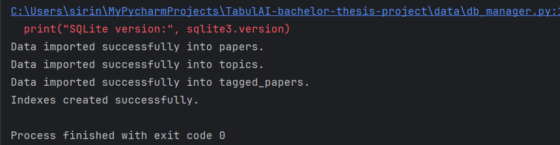
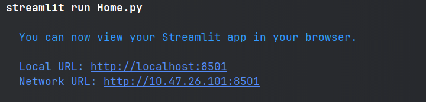
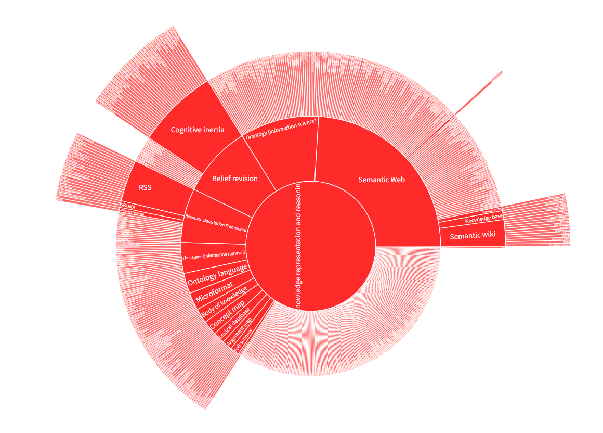

# Bachelor Thesis Project 🎓 
- Data Science Web Application
  
# TabulAI - Trend Analysis Tool for AI Research 

[](https://www.python.org/)

## Introduction

TabulAI is a cutting-edge web application designed to dynamically visualize trends in Artificial Intelligence (AI) research. Developed as part of a Bachelor Thesis project at OsloMet - Oslo Metropolitan University, this tool serves as an exploratory platform to analyze and track the evolution of AI topics. The project, a collaboration with SINTEF and Ontotext, blends theoretical knowledge with practical applications to lay the foundation for advanced trend analysis tools in AI.

## Objectives

- Develop an intuitive, user-friendly platform for visualizing AI research trends.
- Identify and display top trends, key research topics, and the most popular subjects in AI.
- Visualize the hierarchical AI Topic Tree, showcasing the relationships between various AI topics.
- Efficiently process and analyze large datasets to ensure accurate insights.
- Implement machine learning and natural language processing techniques for data vectorization and similarity search.

## Scope - ETL Pipeline

- **Data Extraction and Preprocessing**: Efficiently gather and prepare data for analysis.
- **Data Vectorization and Tagging**: Utilize advanced similarity search techniques to tag research papers with relevant AI topics.
- **Data Storage and Retrieval**: Store and manage the processed data to ensure quick access and retrieval.
- **Interactive Data Visualization**: Develop a dynamic and interactive web application to visualize the analyzed data.

 

## Technologies and Tools
- **Data Sources**: arXiv dataset for academic papers, AI topic list curated from DBPedia/Wikipedia.
- **Vectorization**: KagiSearch, HuggingFace's NLP transformer models for generating text embedding.
- **Similarity Search**: Utilizes Kagi to find cosine similarity to determine most relevant papers.
- **Python Integration**: Both back-end and front-end development is based on Python.
- **Data Analysis**: Jupyter notebook for interactive development.
- **Visualization**: Python frameworks and libraries: Pandas & Numpy for data manipulation, Streamlit, Plotly Dash for advanced data visualizations.

## 1. Data extraction and preprocessing
   * AI Topic list from Ontotext (.csv)
   * arXiv dataset with subcategories (academic papers attributes) (.csv)

## 2. Vectorization 

  ### Methodology:
  - Pre-training the model with AI topics by vectorization.
  - Vectorizing the arXiv dataset.
  - Tagging papers with AI topics.
  - Apply similarity search analysis and evaluation.

  ### Alternative solutions explored

  **Fine-tuning a Pre-Trained Model** (e.g., BERT): This involves adjusting a pre-trained model like BERT to classify academic papers into AI topics, using a manually tagged training dataset.
    
  **Vectorization + Similarity Search** (e.g., FAISS, KagiSearch): This method uses vectorization techniques, such as FAISS or KagiSearch, to convert text data into vectors and perform similarity searches to find related AI topics.
    
  **Zero-Shot Classifier** (e.g., HuggingFace Zero-Shot Classifier): This approach uses a zero-shot learning classifier capable of categorizing text into topics without explicit prior training on those topics.
    
  
  ### The solution we choose to pursue: Vectorization + Similarity Search: 
  This decision was based on several factors:
  - Simplicity and Learnability: Easier and more straightforward, especially given the project's time constraints.
  - Cost-Effectiveness: Avoids licensing costs associated with extensive vector databases.
  - Accuracy in Visualization: This depends on ensuring precise tagging of the dataset, which is crucial for the effectiveness of the similarity search and the accuracy of the resulting visualizations.
    
    The decision to implement a similarity search is not only a strategic choice based on usability and cost considerations but also a purposeful move to strengthen the most critical function of our project – the delivery of accurate, data-driven visualizations that support informed decision-making.
    
  ### Vector Databases and Similarity Search 🔎
  Vector databases and similarity search have their origins in linear algebra concepts, with computational applications emerging since the mid-20th century. The growth of relational databases in the 1970s and 1980s led to the development of early vector space models. The 21st century saw rapid advancements due to the explosion of multi-dimensional data, necessitating specialized databases for efficient handling. This field has consistently advanced with improvements in hardware, algorithms, and data structures, maintaining its relevance in AI and data science.
  
  These technologies are crucial in data science for efficient and accurate information retrieval, especially in AI, machine learning, and information retrieval, where they enable quick access to relevant data.
  
  ### Most Popular Vector Similarity Search Methods:
  
  #### Dot Product:
    - Use: Common in machine learning, data mining, and statistics.
    - Advantages: Speed and simplicity.
    - Limitation: Magnitude sensitivity.
    
  #### Cosine Similarity:
    - Use: In NLP for text similarity, recommendation systems, and image comparison.
    - Advantages: Measures cosine of the angle, insensitive to magnitude.
    - Limitations: Issues with zero vectors, not a true metric.
    
  #### Manhattan Distance (L1 Distance):
    - Use: Clustering, classification, and image analysis.
    - Advantages: Useful in grid-like paths, less sensitive to outliers.
    - Limitation: Not always the shortest distance.
    
  #### Euclidean Distance (L2 Distance):
    - Use: Fundamental in clustering algorithms, image similarity, and recommendation systems.
    - Advantages: Intuitiveness and simplicity.
    - Limitations: Scale sensitivity, is less effective in high-dimensional spaces.
      
  ### Conclusion
  First and foremost, it’s crucial to recognize that no single algorithm reigns supreme in all scenarios. The choice of the most suitable algorithm depends on the nature of the data, the dimensionality, and the specific problem at hand. Therefore, flexibility in algorithm selection is key.
  Reference: [Vector Similarity Search](https://medium.com/@serkan_ozal/vector-similarity-search-53ed42b951d9)

## 3. Visualization 
  
Visualize the evolution of AI topics over time and allowing comparisons between topics requires a thoughtful approach. There are some steps we need to consider carefully to navigate this task:

  1. Understanding the Data
  Before deciding on visualization types, it's crucial to understand the data at hand. This includes knowing the structure of the data, such as the format of the AI topics, the time range covered by the academic papers, and any metadata that might be relevant (e.g., number of publications, citations, etc.).

  2. Choosing the Right Visualization Tools
  Considering our beginner-level skills in data visualization, focusing on a few powerful and versatile chart types can be more effective than trying to learn many different kinds at once. 

  Some of the beginner-friendly chart-types:
  * Line Charts: Ideal for showing trends over time. A line chart could be used to display the evolution of interest in various AI topics by plotting the number of publications per topic over time.
  * Bar Charts: Useful for comparing quantities. These can be used to compare the number of publications between different AI topics in a given year or range of years.
  * Scatter Plots: Good for visualising relationships between two variables. This could help in understanding the correlation between the number of publications and another metric, like citations.
  * Heatmaps: Effective for showing the distribution of data across two dimensions. A heatmap could be used to visualize the density of publications across different AI topics and time periods.
  
  3. Interactive Elements
  Incorporating interactive elements into our dashboard is key to allowing users to choose what to display. This can be done through:
  
  * Dropdown Menus: Allow users to select which AI topic(s) they want to view data for. This could control which data is displayed on a line chart or bar chart.
  * Sliders: Enable users to select time ranges they are interested in exploring. This could dynamically update the charts to show data only within the selected range.
  * Hover Information: Display additional information when the user hovers over a part of the chart, like the exact number of publications in a year for a specific topic.

4. Tool Selection
For creating the dashboard, we think that Streamlit is an excellent choice, especially for developing effectively with a wide range of available widgets and tools. Streamlit allows us for the rapid development of interactive web applications in Python and supports the inclusion of charts, interactive widgets, and more. Streamlit's simplicity and the rich set of features it offers have significantly streamlined the process of building our dashboard.

  ### Streamlit 📊  
  
  Streamlit is our choice for developing a web application in a data science context. It's particularly beneficial because:
  - High compatibility: Streamlit offers a straightforward and intuitive API, making building and deploying web applications easier, especially for rapid development and for those primarily skilled in Python.
  - Interactivity: It allows for creating interactive dashboards which is ideal for showcasing data visualizations and trends.
  - Rapid Prototyping: Streamlit's framework supports rapid prototyping, enabling us to turn data scripts into shareable web apps quickly.
  - Integration with Python Ecosystem: It seamlessly integrates with the Python ecosystem, using libraries like Pandas, Numpy, and Plotly

5. Building the Dashboard

A simplified roadmap we have used for building the Streamlit-dashboard:
- Set Up Dev Environment: Ensuring Streamlit is installed in our Python environment. ```pip install streamlit```
- Loading Data: Using pandas to load and preprocess our data.
- Initialize Streamlit: Start by creating a basic Streamlit script that runs a simple application. This can look like this, see the figure below: Figure 1.
- Add Charts: Utilize libraries like matplotlib, seaborn, or Plotly to create the charts based on our data. Figure 1.
- Make It Interactive: By incorporating Streamlit widgets for user input, like dropdowns and sliders, we can make dynamic charts based on user selections.

Figure 1:
```
import streamlit as st
import pandas as pd
import numpy as np

# Title of the app
st.title('Simple Streamlit App')

# Description
st.write('This is a simple Streamlit app that generates a random time series data and displays a line chart.')

# Generate random data
data = pd.DataFrame({
  'date': pd.date_range(start='1/1/2022', periods=30),
  'value': np.random.randn(30).cumsum()
})

# Plot data
st.line_chart(data.set_index('date'))

# Show data in a table
st.write('Below is the random data generated:', data)

# Simple interaction: Slider
number = st.slider('Choose a number', 0, 100, 50)
st.write('You selected:', number)

```

Mastering every art form, experimentation and iteration will be key to success. Therefore we started with basic visualizations and gradually added complexity and interactivity as we became more comfortable. Utilizing online resources, tutorials, and documentation for Streamlit and visualization libraries has been invaluable.

References:
- Streamlit documentation
- Pandas documentation
- Plotly documentation
- Python documentation
- Our curriculum book for visualisation

## HowTo Run this Application 🤖
- Download the repo as a zip-file and extract the project files in a new folder
- Open the project in your fav IDE
- Run the db_manager.py to populate the database: app_data.db 
You will be seing this on the terminal:


- Install the dependencies by running:

```
pip install -r requirements.txt
```
This will dowload and install the following libraries: streamlit, pandas, numpy, plotly, matplotlib and others...  

 ### Starting the STREAMLIT APP: 
Home.py is the entry point of the application, 
so it's important to save the main module as Home.py. 

```
streamlit run Home.py
```


- Dashboard Navigation: Use the sidebar to navigate through different sections of the application.
- Data Visualization: Interact with the visualizations by selecting different parameters (e.g., AI topics, time range).
- Data Update: To refresh the dataset with the latest papers, click the 'Update Data' button.
- Search Functionality: Use the search bar to query specific AI topics or papers.


### Top Trends:Paper search:


### Topic search:


### Paper Search


### Topic Tree




## Acknowledgments
- We thank to all the supportive and inspirational resources, sponsors, the research-team and our supervisor.

## References
- [enRichMyData](https://www.sintef.no/en/projects/2022/enrichmydata/)
- [InnoGraph](https://www.ontotext.com/blog/the-innograph-artificial-intelligence-taxonomy/)
- [Python Documentation](https://docs.python.org/3/)
- [Streamlit Documentation](https://docs.streamlit.io/)
- [Plotly Dash Documentation](https://dash.plotly.com/)
- [Similarity Search](https://www.earthdata.nasa.gov/dashboard/labs/similarity-search/)
- [FAISS-GitHub](https://github.com/facebookresearch/faiss)
- [Kaggle](https://www.kaggle.com/)
- [HuggingFace](https://huggingface.co/)
- [KagiSearch](https://www.kagi.com/)
- [GitHub VCS](https://github.com/)
- [Google Colab](https://colab.research.google.com/)
- [SINTEF](https://www.sintef.no/)
- [OsloMet](https://www.oslomet.no/en/)

---
[OsloMet, Department of Computer Science](https://www.oslomet.no/en/about/tkd/it) | [SINTEF](https://www.sintef.no/en/) | Copyright © OsloMet // SINTEF
