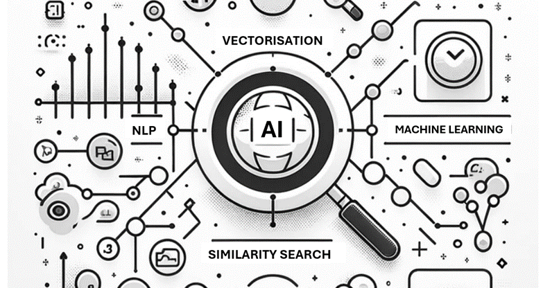
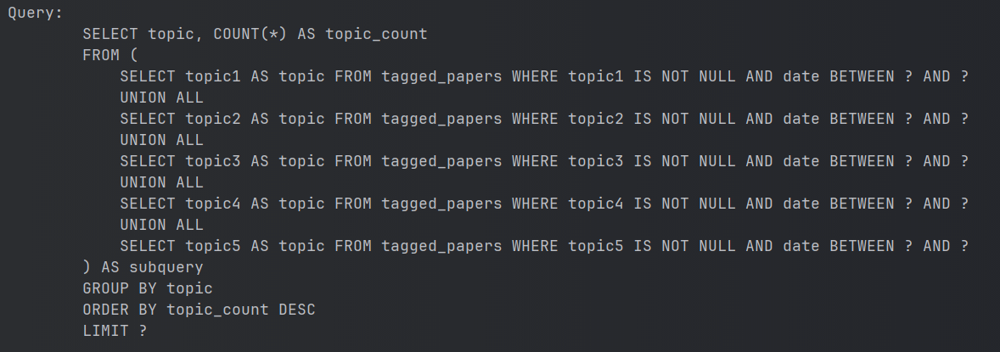
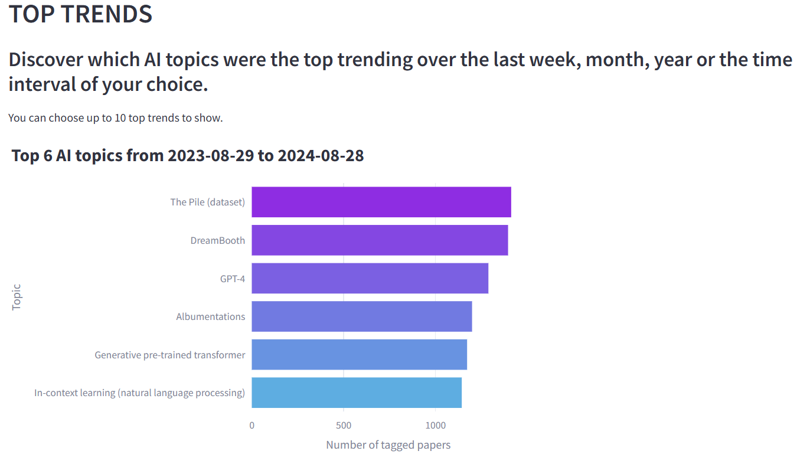
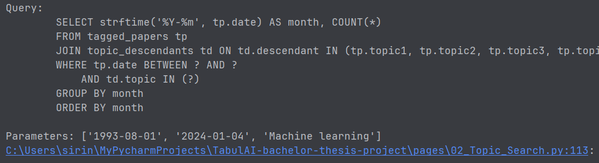
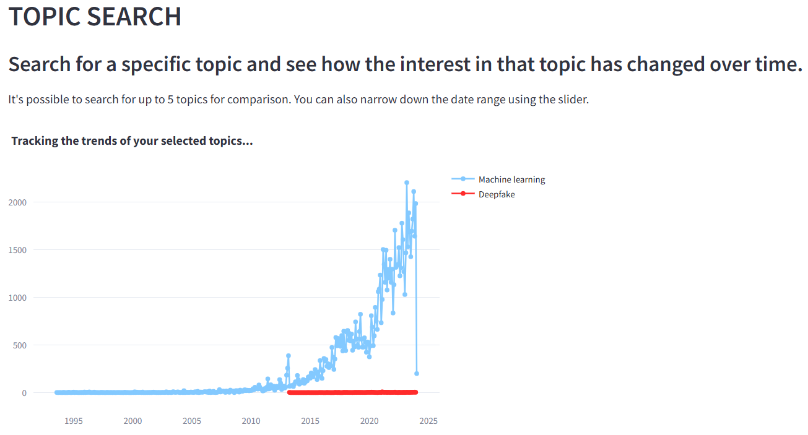
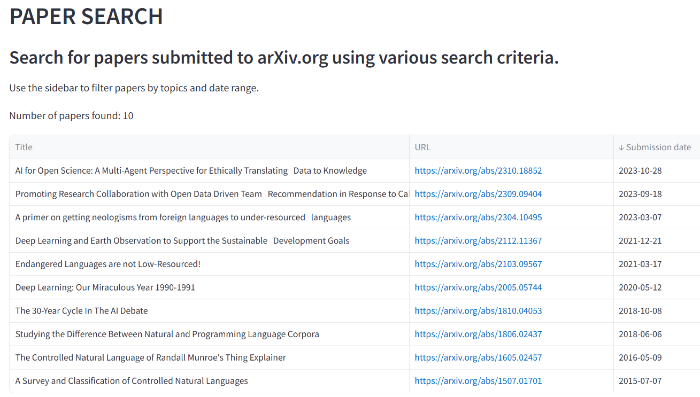
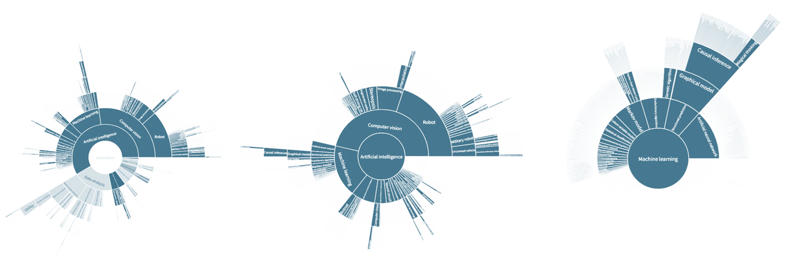
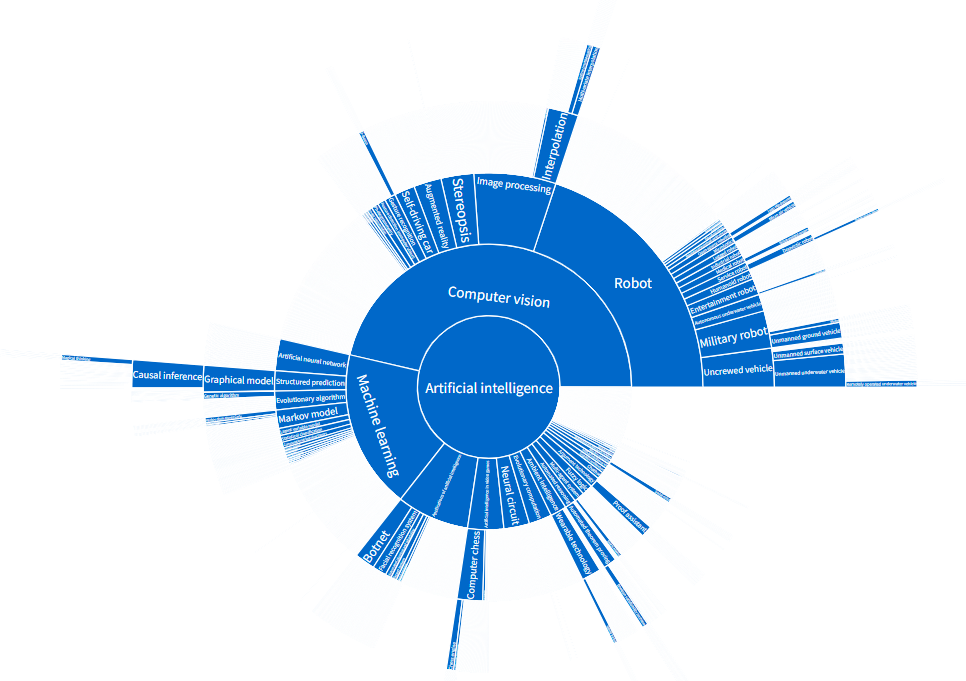
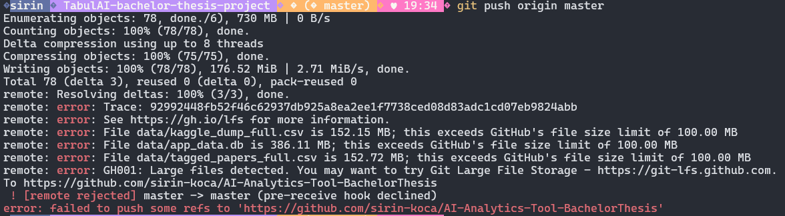
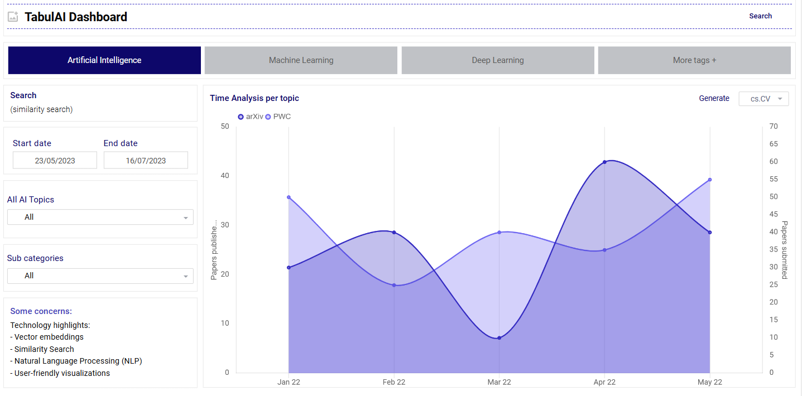

# Bachelor Thesis Project 🎓 
## TabulAI - Data Science Web Application
### An Interactive Data Analytics Tool for Artificial Intelligence (AI)
[](https://www.python.org/)

As part of my Bachelor Thesis, in collaboration with SINTEF, I have developed an interactive web application tool (TabulAI) to demistify and understand the evolution of AI Research.




## Introduction
TabulAI is an interactive data science web application that provides insightful visualizations of AI research trends, helping researchers and stakeholders explore the evolution of AI topics over time.

## Key Features
- **Intuitive Visualizations:** Explore top trends, research topics, and hierarchical AI topic trees.
- **Advanced Data Processing:** Efficient handling and analysis of large datasets using NLP and machine learning.
- **Interactive Dashboard:** Dynamic, user-friendly interface built with Streamlit for real-time data exploration.


## Objectives
- Create an intuitive and user-friendly platform for visualizing AI research trends.
- Show top trends, top research topics, most popular topics in AI reasearch.
- Visualize the hierarchical AI Topic Tree.
- Process and analyse large datasets efficiently and accurately.
- Implement machine learning and NLP techniques for data vectorization and similarity search.

## Scope
- Data extraction and preprocessing.
- Data vectorization, tagging and evaluation of tagging accuracy utilizing similarity search.
- Data storage and retrieval.
- Interactive data visualization tool as a web application.
  

## Technologies and Tools
- **Python:** Backend and frontend development.
- **Streamlit:** Interactive web application.
- **Pandas & Numpy:** Data manipulation.
- **HuggingFace Transformers:** NLP and vectorization.
- **KagiSearch:** Similarity search.
- **Plotly:** Data visualization.


## 1. Data extraction and preprocessing
   * AI Topic list from Ontotext (.csv)
   * arXiv dataset with subcategories (academic papers attributes) (.csv)

## 2. Vectorization 

  ### Methodology:
  - Pre-training the model with AI topics by vectorization.
  - Vectorizing the arXiv dataset.
  - Tagging papers with AI topics.
  - Apply similarity search analysis and evaluation.

  ### Alternative solutions explored

  **Fine-tuning a Pre-Trained Model** (e.g., BERT): This involves adjusting a pre-trained model like BERT to classify academic papers into AI topics, using a manually tagged training dataset.
    
  **Vectorization + Similarity Search** (e.g., FAISS, KagiSearch): This method uses vectorization techniques, such as FAISS or KagiSearch, to convert text data into vectors and perform similarity searches to find related AI topics.
    
  **Zero-Shot Classifier** (e.g., HuggingFace Zero-Shot Classifier): This approach uses a zero-shot learning classifier capable of categorizing text into topics without explicit prior training on those topics.
    
  
  ### The solution we choose to pursue: Vectorization + Similarity Search: 
  This decision was based on several factors:
  - Simplicity and Learnability: Easier and more straightforward, especially given the project's time constraints.
  - Cost-Effectiveness: Avoids licensing costs associated with extensive vector databases.
  - Accuracy in Visualization: This depends on ensuring precise tagging of the dataset, which is crucial for the effectiveness of the similarity search and the accuracy of the resulting visualizations.
    
    The decision to implement a similarity search is not only a strategic choice based on usability and cost considerations but also a purposeful move to strengthen the most critical function of our project – the delivery of accurate, data-driven visualizations that support informed decision-making.
    
  ### Vector Databases and Similarity Search 🔎
  Vector databases and similarity search have their origins in linear algebra concepts, with computational applications emerging since the mid-20th century. The growth of relational databases in the 1970s and 1980s led to the development of early vector space models. The 21st century saw rapid advancements due to the explosion of multi-dimensional data, necessitating specialized databases for efficient handling. This field has consistently advanced with improvements in hardware, algorithms, and data structures, maintaining its relevance in AI and data science.
  
  These technologies are crucial in data science for efficient and accurate information retrieval, especially in AI, machine learning, and information retrieval, where they enable quick access to relevant data.
  
  ### Most Popular Vector Similarity Search Methods:
  
  #### Dot Product:
    - Use: Common in machine learning, data mining, and statistics.
    - Advantages: Speed and simplicity.
    - Limitation: Magnitude sensitivity.
    
  #### Cosine Similarity:
    - Use: In NLP for text similarity, recommendation systems, and image comparison.
    - Advantages: Measures cosine of the angle, insensitive to magnitude.
    - Limitations: Issues with zero vectors, not a true metric.
    
  #### Manhattan Distance (L1 Distance):
    - Use: Clustering, classification, and image analysis.
    - Advantages: Useful in grid-like paths, less sensitive to outliers.
    - Limitation: Not always the shortest distance.
    
  #### Euclidean Distance (L2 Distance):
    - Use: Fundamental in clustering algorithms, image similarity, and recommendation systems.
    - Advantages: Intuitiveness and simplicity.
    - Limitations: Scale sensitivity, is less effective in high-dimensional spaces.
      
  ### Conclusion
  First and foremost, it’s crucial to recognize that no single algorithm reigns supreme in all scenarios. The choice of the most suitable algorithm depends on the nature of the data, the dimensionality, and the specific problem at hand. Therefore, flexibility in algorithm selection is key.
  Reference: [Vector Similarity Search](https://medium.com/@serkan_ozal/vector-similarity-search-53ed42b951d9)

## 3. Visualization 
  
Visualize the evolution of AI topics over time and allowing comparisons between topics requires a thoughtful approach. There are some steps we need to consider carefully to navigate this task:

  1. Understanding the Data
  Before deciding on visualization types, it's crucial to understand the data at hand. This includes knowing the structure of the data, such as the format of the AI topics, the time range covered by the academic papers, and any metadata that might be relevant (e.g., number of publications, citations, etc.).

  2. Choosing the Right Visualization Tools
  Considering our beginner-level skills in data visualization, focusing on a few powerful and versatile chart types can be more effective than trying to learn many different kinds at once. 

  Some of the beginner-friendly chart-types:
  * Line Charts: Ideal for showing trends over time. A line chart could be used to display the evolution of interest in various AI topics by plotting the number of publications per topic over time.
  * Bar Charts: Useful for comparing quantities. These can be used to compare the number of publications between different AI topics in a given year or range of years.
  * Scatter Plots: Good for visualising relationships between two variables. This could help in understanding the correlation between the number of publications and another metric, like citations.
  * Heatmaps: Effective for showing the distribution of data across two dimensions. A heatmap could be used to visualize the density of publications across different AI topics and time periods.
  
  3. Interactive Elements
  Incorporating interactive elements into our dashboard is key to allowing users to choose what to display. This can be done through:
  
  * Dropdown Menus: Allow users to select which AI topic(s) they want to view data for. This could control which data is displayed on a line chart or bar chart.
  * Sliders: Enable users to select time ranges they are interested in exploring. This could dynamically update the charts to show data only within the selected range.
  * Hover Information: Display additional information when the user hovers over a part of the chart, like the exact number of publications in a year for a specific topic.

4. Tool Selection
For creating the dashboard, we think that Streamlit is an excellent choice, especially for developing effectively with a wide range of available widgets and tools. Streamlit allows us for the rapid development of interactive web applications in Python and supports the inclusion of charts, interactive widgets, and more. Streamlit's simplicity and the rich set of features it offers have significantly streamlined the process of building our dashboard.

  ### Streamlit 📊  
  
  Streamlit is our choice for developing this web application in a data science context. It's particularly beneficial because:
  - High compatibility: Streamlit offers a straightforward and intuitive API, making building and deploying web applications easier, especially for rapid development and for those primarily skilled in Python.
  - Interactivity: It allows for creating interactive dashboards which is ideal for showcasing data visualizations and trends.
  - Rapid Prototyping: Streamlit's framework supports rapid prototyping, enabling us to turn data scripts into shareable web apps quickly.
  - Integration with Python Ecosystem: It seamlessly integrates with the Python ecosystem, using libraries like Pandas, Numpy, and Plotly

References:
- Streamlit documentation
- Pandas documentation
- Plotly documentation
- Python documentation
- Our curriculum book for visualisation

# HowTo Run this Application 🤖

### Prerequisites
- Python 3.8+
- Git (for cloning the repository)

1. **Clone the repository:**
   ```bash
   git clone https://github.com/sirin-koca/AI-Analytics-Tool-BachelorThesis.git
   cd AI-Analytics-Tool-BachelorThesis


2.**Install the dependencies by running**:

```
pip install -r requirements.txt
```

This will dowload and install the following libraries: streamlit, pandas, numpy, plotly, matplotlib and others...  

3.**Set-up and populate the app.db**:

```
python util/db_manager.py
```

4.**Start the Streamlit App**:

```
streamlit run Home.py
```

- Dashboard Navigation: Use the sidebar to navigate through different sections of the application.
- Data Visualization: Interact with the visualizations by selecting different parameters (e.g., AI topics, time range).
- Data Update: To refresh the dataset with the latest papers, click the 'Update Data' button.
- Search Functionality: Use the search bar to query specific AI topics or papers.


# Screenshots

## TabulAI 
### Top Trends: n number of topics to analyze:










## TOPIC TREE




## Issues with BIG DATASETS

See https://gh.io/lfs for more information.  

## Wireframes


## Acknowledgments
This project received a Grade **A** as part of my Bachelor Thesis at OsloMet, developed in collaboration with SINTEF. Special thanks to my team members, Ahmet and Emma, and our supervisor for their guidance and support.


## References
- [enRichMyData](https://www.sintef.no/en/projects/2022/enrichmydata/)
- [FAISS-GitHub](https://github.com/facebookresearch/faiss)
- [Google Colab](https://colab.research.google.com/)
- [HuggingFace](https://huggingface.co/)
- [InnoGraph](https://www.ontotext.com/blog/the-innograph-artificial-intelligence-taxonomy/)
- [Kaggle](https://www.kaggle.com/)
- [KagiSearch](https://www.kagi.com/)
- [OsloMet](https://www.oslomet.no/en/)
- [Plotly Dash](https://dash.plotly.com/)
- [Python ](https://docs.python.org/3/)
- [Similarity Search](https://www.earthdata.nasa.gov/dashboard/labs/similarity-search/)
- [SINTEF](https://www.sintef.no/)
- [Streamlit](https://docs.streamlit.io/)


---
Sirin Koca | [OsloMet, Department of Computer Science](https://www.oslomet.no/en/about/tkd/it) | [SINTEF](https://www.sintef.no/en/) | Copyright © OsloMet // SINTEF
